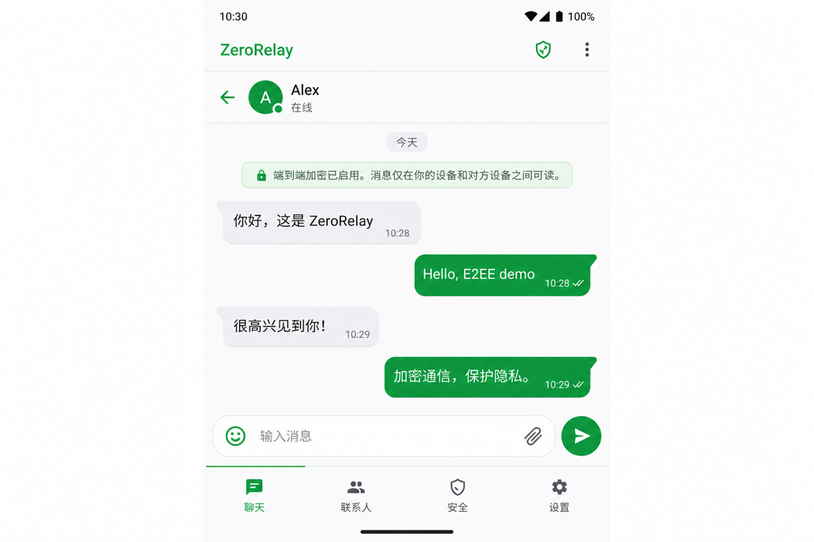
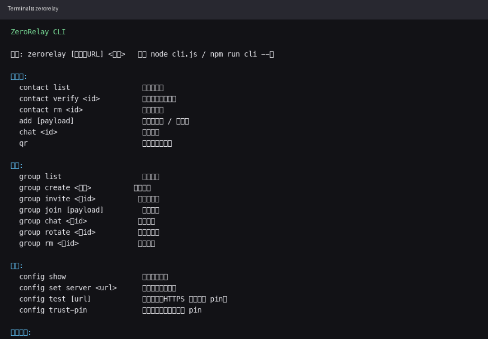

# ZeroRelay

**端到端加密聊天**，中继可自建。消息在设备上加密，服务器只转发**密文**。

**文档：** [English](README.md) · 简体中文 · [全部文档](docs/README.zh-CN.md) · [English index](docs/README.md)

[](https://deploy.workers.cloudflare.com/?url=https://github.com/runsli/ZeroRelay/tree/main/server)
[](https://github.com/runsli/ZeroRelay/releases)

| 客户端 | 平台 |
|--------|------|
| **Android** | Jetpack Compose · Material 3 |
| **CLI** | Node.js 终端 |
| **中继** | 本地 Node · 生产环境 Cloudflare Workers |

## 界面截图

> 将图片放入 [`docs/screenshots/`](docs/screenshots/README.zh-CN.md)，提交后下方会自动显示。

| Android | CLI |
|---------|-----|
|  |  |

*可选：* [首页](docs/screenshots/android-home.png) · [设置](docs/screenshots/android-settings.png)

---

## 快速上手（约 5 分钟）

你需要一个 **HTTPS 中继地址** 和 **任意客户端**。使用同一中继的人彼此可以聊天。

### 1. 部署中继（或使用他人提供的地址）

**最简单：** 点击上方 **Deploy to Cloudflare** → 登录部署。你会得到一个中继地址，例如 `https://zero-relay-server.<你>.workers.dev`。

检查：`curl https://<你的-worker>.workers.dev/health`

更多方式（本地调试、自定义域名、Wrangler CLI）：[docs/DEPLOYMENT.zh-CN.md](docs/DEPLOYMENT.zh-CN.md) · [server/README.zh-CN.md](server/README.md)

### 2. 安装 Android 应用

从 **[GitHub Releases](https://github.com/runsli/ZeroRelay/releases)** 下载最新的 **`zerorelay-v*.apk`**。

或自行编译 Debug：`cd android && ./gradlew assembleDebug`（见 [自行编译](#自行编译)）。

**界面语言：** Android 应用跟随**系统语言** — 默认英文（`values/`），系统为中文时使用简体（`values-zh-rCN/`）。

### 3. 开始聊天

1. 打开 App → **设置** → 填写 **中继 HTTPS 地址** → **测试连接**（首次可能需信任证书 pin）。
2. 把你的联系人二维码 / 链接发给对方（对方须使用**同一中继地址**）。
3. 互相添加、核对**安全码**、标记已验证后发消息。

**CLI：** `git clone https://github.com/runsli/ZeroRelay.git && ./scripts/cli-setup.sh` → `zerorelay`（编号菜单）或 `zerorelay config set server https://你的中继地址`

---

## 中继能看到什么

| 中继能看到 | 中继**不能**看到 |
|------------|------------------|
| 密文、投递相关元数据 | 消息明文 |
| `routeHash`、时间、大小 | 你的私钥 |
| 短期 KV 缓存（默认约 2 小时） | 长期聊天记录 |

详见 [docs/SECURITY.zh-CN.md](docs/SECURITY.zh-CN.md) · [English](docs/SECURITY.md) · [docs/PROTOCOL.zh-CN.md](docs/PROTOCOL.zh-CN.md) · [English](docs/PROTOCOL.md)

---

## 核心特性

- **端到端加密：** X25519、HKDF、棘轮 v2（AES-256-GCM）；群聊使用共享密钥
- **中继加固：** HMAC 房间令牌、Ed25519 签名、速率限制
- **Android：** WebSocket + HTTP 回退、可选 Material You 动态色、自适应布局
- **互通：** Android、CLI 使用同一套协议

---

## 自行编译

| 目标 | 说明 |
|------|------|
| 本地中继 | `cd server && npm install && npm start` |
| Android Debug | JDK 17+（推荐 26）、SDK 37 → `cd android && ./gradlew assembleDebug` |
| Android Release | [docs/GITHUB_RELEASES.zh-CN.md](docs/GITHUB_RELEASES.zh-CN.md) · [English](docs/GITHUB_RELEASES.md) |
| CLI | `./scripts/cli-setup.sh` · `zerorelay help` |
| 协议 / 互操作测试 | [docs/PROTOCOL.zh-CN.md](docs/PROTOCOL.zh-CN.md) · [English](docs/PROTOCOL.md) · `npm run test:interop` |
| 全部文档索引 | [docs/README.zh-CN.md](docs/README.zh-CN.md) |

目录结构：

```
ZeroRelay/
├── android/     # Android 客户端
├── server/      # 中继（Worker + 本地 Node）
└── cli.js       # 命令行入口
```

---

## 维护者与贡献者

开发与 CI 说明见 **[CONTRIBUTING.zh-CN.md](CONTRIBUTING.zh-CN.md)** · [English](CONTRIBUTING.md)。

- **发布 Android 正式版：** 更新 `android/version.properties`，推送标签 `vX.Y.Z` → [docs/GITHUB_RELEASES.zh-CN.md](docs/GITHUB_RELEASES.zh-CN.md) · [English](docs/GITHUB_RELEASES.md)
- **F-Droid / 可复现构建：** [docs/F-DROID.zh-CN.md](docs/F-DROID.zh-CN.md) · [English](docs/F-DROID.md)
- **完整部署清单：** [docs/DEPLOYMENT.zh-CN.md](docs/DEPLOYMENT.zh-CN.md) · [English](docs/DEPLOYMENT.md)
- **依赖审计：** `npm run audit:all`

签名文件（`*.jks`、`keystore.properties`）**切勿**提交到 Git。

---

## 许可证

MIT
